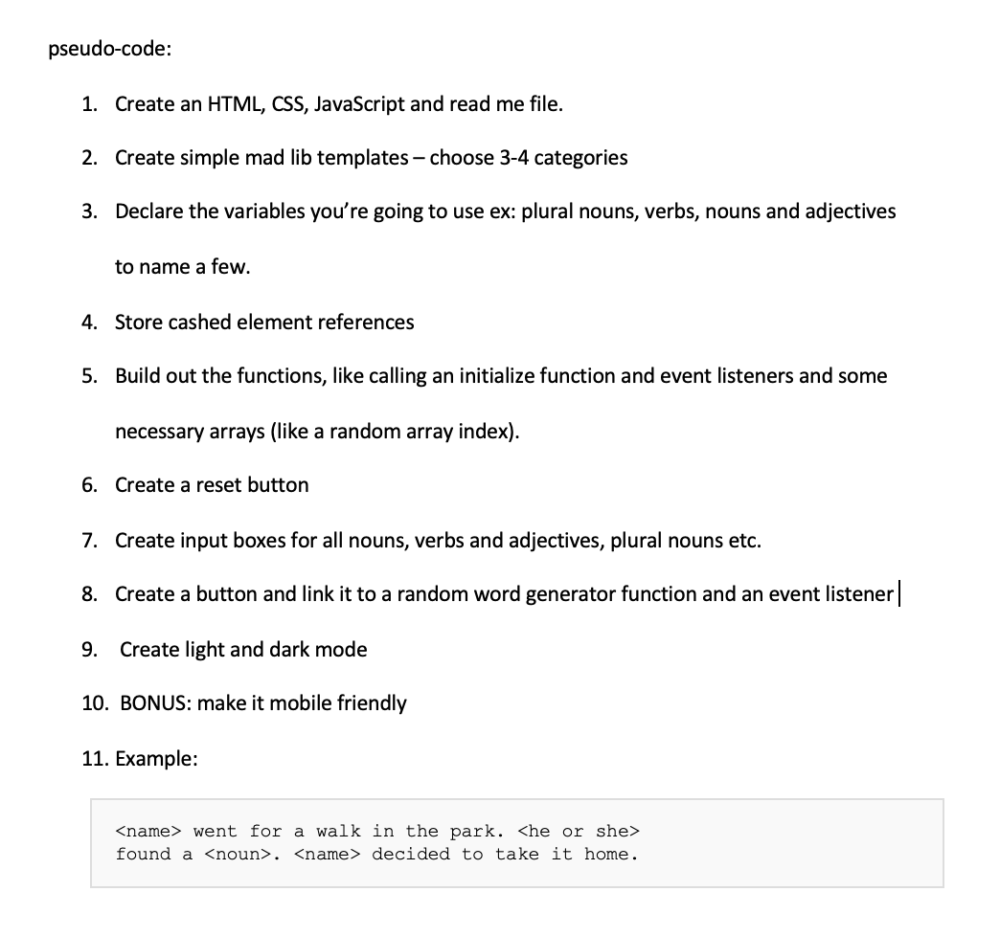

ADULT MAD LIBS 

players will fill in the blanks (inputs) with adjectives, nouns, verbs, and more. When the words are inserted into the blanks and and lib it is pressed, the story will generate and render on to the browser and is read aloud to receive hilarious results. There are no winners or losers, only laughter. This was my favorite childhood game and it always made me laugh which is why I chose to build this game.

Getting started:
Step 1: pick a category
Step 2: think of funny nouns and input them in the noun input box
Step 3: think of funny verbs and input them in the verb input box
Step 4: think of funny adverbs and input them in the adverb input box
Step 5: think of funny adjectives and input them in the adjectives input box
Step 6: think of funny plural nouns and input them in the plural nouns input box
Step 7: or you can choose to press the "random" button that will generate a random noun/verb/adverb etc... for you.
Step 8: or you can choose to press the "totally random" button that will randomly generate all the variables for the player
Step 9: laugh
Step 10: reset and play all over again!

To play Mad libs click here: 
- [sj-madlibs](https://sj-madlibs.netlify.app/)

Technologies and sites used: 
 - html
 - css
 - javascript
 - google fonts
 - animate.css

Credit: audio from:
- [Bensounds](https://www.bensound.com/)

button design from:
- [neomorphism](https://neumorphism.io/#e0e0e0)

fonts from:
- [googlefonts](https://fonts.google.com/)

Pseudo Code:

images:

Next steps: 
- mobile design 
- more categories
- better templates